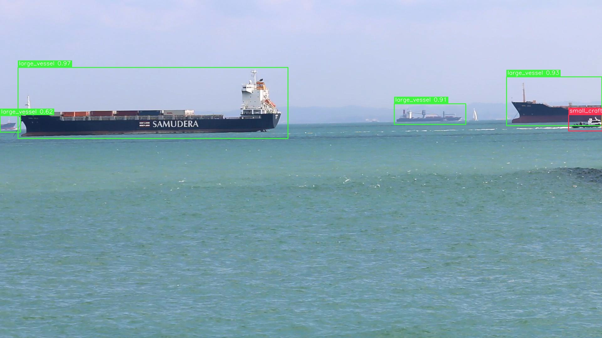
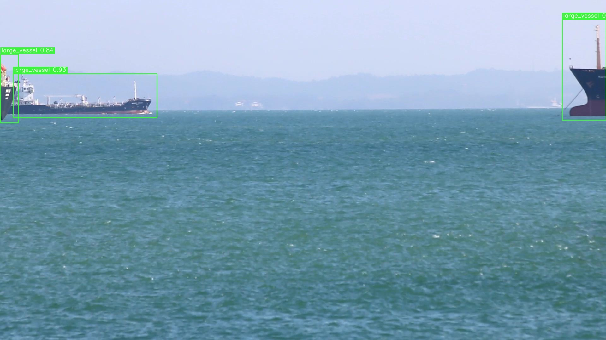
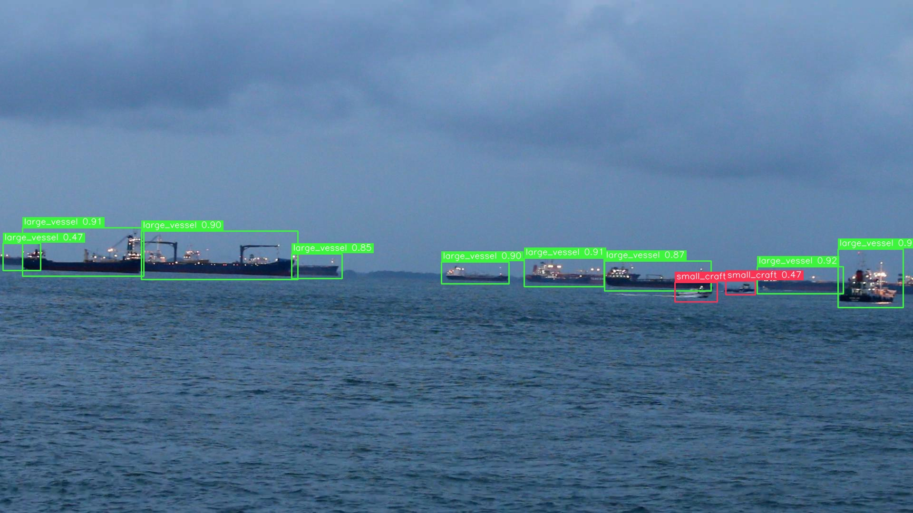
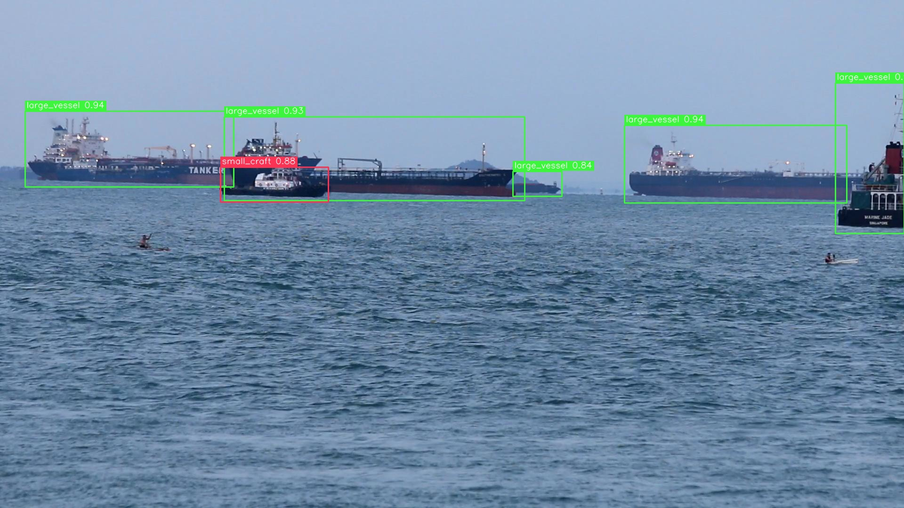

# HarborWatch

HarborWatch is an end-to-end maritime computer vision project that turns raw coastal videos into structured vessel and buoy detections.

The repository is built as a production-style portfolio project, not a notebook demo:
- Data intake from raw videos
- Frame sampling and dataset creation
- CVAT annotation + validation workflow
- RF-DETR training and retraining
- Offline video inference with saved analytics artifacts

## Classes
- `large_vessel`
- `small_craft`
- `buoy`

## Demo

### Snapshots
| Snapshot 1 | Snapshot 2 |
| --- | --- |
|  |  |

| Snapshot 3 | Snapshot 4 |
| --- | --- |
|  |  |

### GIF Previews
| Demo 1 | Demo 2 |
| --- | --- |
|  |  |

| Demo 3 | Demo 4 |
| --- | --- |
|  |  |

If a markdown client does not animate GIFs inline, open them directly:
- [Demo 1](docs/images/demo_01.gif)
- [Demo 2](docs/images/demo_02.gif)
- [Demo 3](docs/images/demo_03.gif)
- [Demo 4](docs/images/demo_04.gif)

## Validation Metrics Reached at Epoch 53

### Overall
- mAP 50:95: **0.4917**
- mAR: **0.6554**
- AP50: **0.5404**
- AP75: **0.5853**
- F1 sweep: **0.6537**
- Precision: **0.9325**
- Recall: **0.5491**

### Per-class
- **buoy** — AP 50:95: **0.2431**, AR: **0.2952**, F1: **0.3797**, Precision: **0.9375**, Recall: **0.2381**
- **large_vessel** — AP 50:95: **0.7116**, AR: **0.7866**, F1: **0.8833**, Precision: **0.9114**, Recall: **0.8569**
- **small_craft** — AP 50:95: **0.5204**, AR: **0.6739**, F1: **0.6981**, Precision: **0.9487**, Recall: **0.5522**

## End-to-End Pipeline
1. Register source videos and build a video registry.
2. Sample frames into an annotation pool.
3. Annotate in CVAT and validate exports.
4. Build COCO train/val/test splits by video.
5. Export RF-DETR-ready dataset layout.
6. Train baseline model and iterate.
7. Run offline inference and save outputs.

## Setup
```bash
python -m venv .venv
source .venv/bin/activate
pip install -r requirements.txt
```

## Quick Start

### 1) Register raw videos
```bash
python scripts/register_videos.py \
  --video-dir data/raw/smd_visible_onshore/videos \
  --source-name smd_visible_onshore \
  --output-csv data/registry/video_registry.csv \
  --output-json data/registry/video_registry.json \
  --recursive
```

### 2) Sample frames
```bash
python scripts/sample_frames.py \
  --video-root data/raw/smd_visible_onshore/videos \
  --registry-csv data/registry/video_registry.csv \
  --output-dir data/interim/sampled_frames \
  --manifest-csv data/registry/frame_manifest.csv \
  --manifest-jsonl data/registry/frame_manifest.jsonl \
  --sample-every-seconds 5.0 \
  --only-usable-yes \
  --only-keep-for-mvp-yes
```

### 3) Validate CVAT COCO export
```bash
python scripts/validate_coco_export.py \
  --input-json data/annotations/raw/annotations.json \
  --image-root data/interim/sampled_frames \
  --output-json outputs/data_audit/phase3/annotation_validation_report.json
```

### 4) Prepare COCO splits
```bash
python scripts/prepare_coco_splits.py \
  --input-json data/annotations/v2/annotations_clean.json \
  --image-root data/interim/v2_sampled_frames \
  --output-dir data/processed/harborwatch_coco_v2_clean \
  --train-ratio 0.70 \
  --val-ratio 0.15 \
  --seed 42 \
  --copy-mode copy
```

### 5) Export for RF-DETR
```bash
python scripts/export_for_rfdetr.py \
  --input-dir data/processed/harborwatch_coco_v2_clean \
  --output-dir data/processed/harborwatch_rfdetr_coco_v2_clean \
  --copy-mode copy
```

### 6) Train model
```bash
python scripts/train_rfdetr_baseline.py --config configs/train_rfdetr.yaml
```

### 7) Inference on video
```bash
python scripts/infer_video.py --config configs/infer_video.yaml
```

## Inference Artifacts
Each run writes a complete output folder under `outputs/runs/<run_name>/`:
- `annotated_video.mp4`
- `detections.csv`
- `detections.jsonl`
- `run_metadata.json`
- `summary.md`
- `snapshots/`

## Key Files
- `configs/project.yaml`
- `configs/annotation.yaml`
- `configs/train_rfdetr*.yaml`
- `configs/infer_video.yaml`
- `scripts/`
- `docs/annotation_guidelines.md`
- `docs/class_taxonomy.md`
- `docs/PROJECT_SCOPE.md`

## Repository Layout
```text
harborwatch/
├── configs/     # YAML configs
├── data/        # local datasets/registries (ignored by git)
├── docs/        # documentation and media
├── outputs/     # runs, checkpoints, audits (ignored by git)
├── scripts/     # pipeline scripts
├── requirements.txt
└── README.md
```

## Version Control Note
The repo tracks code, configs, and docs. Large local artifacts are ignored through `.gitignore` (`data/` and `outputs/`).

## License
MIT
